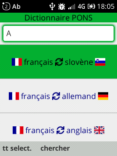
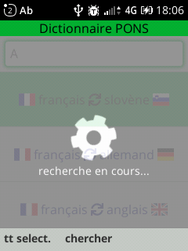
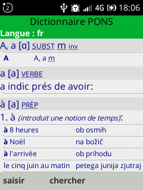

# KAI-pons-dictionnaries
KAI os application to get translations using the PONS dictionnary.

This application uses the PONS dictionnary API (https://en.pons.com/p/online-dictionary/developers/api). You need first to create a free account and get a credential from PONS and create a `0_credential.js` file in the `application` directory containing the line : `const authenticationKey = "my_PONS_account_credential"`.

# Use
1) Choose the language to translate from/to using the up/down keys. Then enter the word to search for and press "chercher" to get the translation.  

  

2) Wait for the translations.  

  

3) The translations are displayed, you can scroll using the up/down keys. Press "saisir" to look for a new word.  

  

# Credits

This application uses :
- the PONS dictionnary API (https://en.pons.com/p/online-dictionary/developers/api)
- Fontawesome 5 icons (https://fontawesome.com/v5/search)
- Free country flags in SVG (https://flagicons.lipis.dev/)

# Bugs
- Pressing `Backspace` on the word input field with a word selected does nothing. To clear this existing input, you have to press `Backspace` longer.
